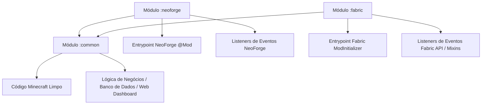

# Estudo de Viabilidade e Plano de Portabilidade: BigBangEssentials para Fabric e NeoForge

Este documento detalha o levantamento técnico e o plano de ação necessários para portar o mod **BigBangEssentials** (atualmente restrito ao **NeoForge 1.21.1**) de forma que ele seja compatível e buildado também para o mod loader **Fabric**.

---

## 1. Abordagem Recomendada: Projeto Multi-Módulo (Multi-Loader)

Para evitar duplicar o código e manter a base unificada (Single Source of Truth), a prática recomendada no modding moderno do Minecraft é reestruturar o Gradle como um projeto multi-módulo.

### Estrutura do Projeto


Na prática, a estrutura de diretórios do repositório será reorganizada da seguinte maneira:

```text
BigBangEssentials/
├── build.gradle                 # Configurações globais
├── settings.gradle              # Declaração dos subprojetos
├── gradle.properties            # Versões unificadas
├── common/
│   ├── build.gradle             # Dependências comuns (sem APIs de loaders)
│   └── src/main/java/           # 90%+ do código do mod (Lógica, DB, Comandos, etc.)
├── neoforge/
│   ├── build.gradle             # Configurações do NeoForge (ModDevGradle)
│   └── src/
│       ├── main/java/           # Inicializadores e Eventos do NeoForge
│       └── main/resources/
│           └── META-INF/
│               └── neoforge.mods.toml
└── fabric/
    ├── build.gradle             # Configurações do Fabric (Fabric Loom)
    └── src/
        ├── main/java/           # Inicializadores, Eventos e Mixins do Fabric
        └── main/resources/
            ├── fabric.mod.json
            └── bigbangessentials.mixins.json
```

---

## 2. Ponte de Abstração: O Módulo `Platform`

Para que o código no módulo `common` acesse recursos específicos de cada mod loader sem depender diretamente de suas classes, criamos uma ponte de abstração de plataforma.

### 2.1. O Provedor de Plataforma (`PlatformProvider.java`)
No módulo `common`, definimos a interface que descreve o que os loaders devem implementar:

```java
package com.pedrodalben.bigbangessentials.util;

import net.minecraft.server.MinecraftServer;
import net.minecraft.world.entity.Entity;
import net.minecraft.nbt.CompoundTag;
import java.nio.file.Path;
import java.util.Collection;

public interface PlatformProvider {
    MinecraftServer getCurrentServer();
    Path getConfigDir();
    Path getGameDir();
    boolean isModLoaded(String modId);
    Collection<String> getLoadedMods();
    CompoundTag getPersistentData(Entity entity);
}
```

### 2.2. A Classe de Acesso (`Platform.java`)
Também no módulo `common`, criamos a classe estática que expõe as funcionalidades:

```java
package com.pedrodalben.bigbangessentials.util;

import net.minecraft.server.MinecraftServer;
import net.minecraft.world.entity.Entity;
import net.minecraft.nbt.CompoundTag;
import java.nio.file.Path;
import java.util.Collection;

public class Platform {
    private static PlatformProvider provider;

    public static void init(PlatformProvider provider) {
        if (Platform.provider != null) {
            throw new IllegalStateException("Plataforma já inicializada!");
        }
        Platform.provider = provider;
    }

    public static MinecraftServer getCurrentServer() {
        return provider.getCurrentServer();
    }

    public static Path getConfigDir() {
        return provider.getConfigDir();
    }

    public static Path getGameDir() {
        return provider.getGameDir();
    }

    public static boolean isModLoaded(String modId) {
        return provider.isModLoaded(modId);
    }

    public static Collection<String> getLoadedMods() {
        return provider.getLoadedMods();
    }

    public static CompoundTag getPersistentData(Entity entity) {
        return provider.getPersistentData(entity);
    }
}
```

### 2.3. Implementações Específicas
Durante a inicialização do mod em cada plataforma, registramos o respectivo provedor.

* **No módulo `:neoforge`**:
```java
public class NeoForgePlatformProvider implements PlatformProvider {
    @Override
    public MinecraftServer getCurrentServer() {
        return net.neoforged.neoforge.server.ServerLifecycleHooks.getCurrentServer();
    }
    @Override
    public Path getConfigDir() {
        return net.neoforged.fml.loading.FMLPaths.CONFIGDIR.get();
    }
    @Override
    public Path getGameDir() {
        return net.neoforged.fml.loading.FMLPaths.GAMEDIR.get();
    }
    @Override
    public boolean isModLoaded(String modId) {
        return net.neoforged.fml.ModList.get().isLoaded(modId);
    }
    @Override
    public Collection<String> getLoadedMods() {
        return net.neoforged.fml.ModList.get().getMods().stream()
                .map(net.neoforged.fml.loading.moddiscovery.ModInfo::getModId)
                .toList();
    }
    @Override
    public CompoundTag getPersistentData(Entity entity) {
        return entity.getPersistentData();
    }
}
```

* **No módulo `:fabric`**:
```java
public class FabricPlatformProvider implements PlatformProvider {
    private static MinecraftServer activeServer;

    public static void setServer(MinecraftServer server) {
        activeServer = server;
    }

    @Override
    public MinecraftServer getCurrentServer() {
        return activeServer;
    }
    @Override
    public Path getConfigDir() {
        return net.fabricmc.loader.api.FabricLoader.getInstance().getConfigDir();
    }
    @Override
    public Path getGameDir() {
        return net.fabricmc.loader.api.FabricLoader.getInstance().getGameDir();
    }
    @Override
    public boolean isModLoaded(String modId) {
        return net.fabricmc.loader.api.FabricLoader.getInstance().isModLoaded(modId);
    }
    @Override
    public Collection<String> getLoadedMods() {
        return net.fabricmc.loader.api.FabricLoader.getInstance().getAllMods().stream()
                .map(m -> m.getMetadata().getId())
                .toList();
    }
    @Override
    public CompoundTag getPersistentData(Entity entity) {
        return ((FabricEntityDataAccessor) entity).bbEssentials$getPersistentData();
    }
}
```

---

## 3. Adaptação e Mapeamento de Eventos

Atualmente, o BigBangEssentials possui aproximadamente 76 listeners anotados com `@SubscribeEvent`. A estratégia consiste em **remover** essas anotações do módulo `common` e manter apenas métodos estáticos/instâncias normais que recebem parâmetros vanilla do Minecraft. 

Os subprojetos `:neoforge` e `:fabric` serão responsáveis por registrar seus respectivos listeners e direcionar a chamada para a lógica comum.

### Tabela de Equivalência de Eventos

| Evento NeoForge | Evento Fabric (Fabric API) | Lógica no BigBangEssentials |
| :--- | :--- | :--- |
| `RegisterCommandsEvent` | `CommandRegistrationCallback.EVENT` | Registro de comandos do mod |
| `ServerStartingEvent` | `ServerLifecycleEvents.SERVER_STARTING` | Inicialização dos managers (Permissões, DB) |
| `ServerStartedEvent` | `ServerLifecycleEvents.SERVER_STARTED` | Inicialização do ChatIntegration / WebServer |
| `ServerStoppingEvent` | `ServerLifecycleEvents.SERVER_STOPPING` | Shutdown limpo e salvamento do DB |
| `PlayerEvent.PlayerLoggedInEvent` | `ServerPlayConnectionEvents.JOIN` | Carregar dados do jogador (Jobs, economia) |
| `PlayerEvent.PlayerLoggedOutEvent` | `ServerPlayConnectionEvents.DISCONNECT` | Salvar dados e limpar cache |
| `ServerTickEvent.Post` | `ServerTickEvents.END_SERVER_TICK` | Atualização do AFK System / Agendador |
| `ServerChatEvent` | `ServerMessageEvents.ALLOW_CHAT_MESSAGE` | Moderação, canais de chat e silenciamentos |
| `BlockEvent.BreakEvent` | `PlayerBlockBreakEvents.BEFORE` | Pagamento de Jobs / Fortuna Natural / Proteção |
| `BlockEvent.EntityPlaceEvent` | `UseBlockCallback.EVENT` (ou Mixin) | Anti-exploit de posicionamento de bloco |
| `LivingDeathEvent` | `ServerEntityWorldChangeEvents` / Mixin | Pagamento de Jobs ao matar mob |
| `ItemFishedEvent` | Mixin em `FishingHook` | Pagamento de Jobs de Pesca |

---

## 4. Desafios Técnicos Específicos e Soluções

### 4.1. Persistência de Dados de Entidades (`bbe_spawner_spawned`)
O NeoForge adiciona o método `getPersistentData()` em todas as entidades. No Fabric/Vanilla, esse método não existe. 

Para resolver isso de forma nativa e sem bibliotecas de terceiros complexas, implementamos um Mixin no Fabric para injetar essa funcionalidade:

1. **Interface Acessora (`FabricEntityDataAccessor.java`):**
```java
package com.pedrodalben.bigbangessentials.fabric.accessor;

import net.minecraft.nbt.CompoundTag;

public interface FabricEntityDataAccessor {
    CompoundTag bbEssentials$getPersistentData();
}
```

2. **Injeção de Mixin (`EntityPersistentDataMixin.java`):**
```java
package com.pedrodalben.bigbangessentials.fabric.mixin;

import com.pedrodalben.bigbangessentials.fabric.accessor.FabricEntityDataAccessor;
import net.minecraft.nbt.CompoundTag;
import net.minecraft.world.entity.Entity;
import org.spongepowered.asm.mixin.Mixin;
import org.spongepowered.asm.mixin.Unique;
import org.spongepowered.asm.mixin.injection.At;
import org.spongepowered.asm.mixin.injection.Inject;
import org.spongepowered.asm.mixin.injection.callback.CallbackInfo;
import org.spongepowered.asm.mixin.injection.callback.CallbackInfoReturnable;

@Mixin(Entity.class)
public class EntityPersistentDataMixin implements FabricEntityDataAccessor {
    @Unique
    private CompoundTag bbEssentials$persistentData;

    @Override
    public CompoundTag bbEssentials$getPersistentData() {
        if (this.bbEssentials$persistentData == null) {
            this.bbEssentials$persistentData = new CompoundTag();
        }
        return this.bbEssentials$persistentData;
    }

    @Inject(method = "saveWithoutId", at = @At("HEAD"))
    private void writeCustomData(CompoundTag tag, CallbackInfoReturnable<CompoundTag> cir) {
        if (this.bbEssentials$persistentData != null && !this.bbEssentials$persistentData.isEmpty()) {
            tag.put("BigBangEssentialsData", this.bbEssentials$persistentData);
        }
    }

    @Inject(method = "load", at = @At("HEAD"))
    private void readCustomData(CompoundTag tag, CallbackInfo ci) {
        if (tag.contains("BigBangEssentialsData", 10)) {
            this.bbEssentials$persistentData = tag.getCompound("BigBangEssentialsData");
        }
    }
}
```

### 4.2. Eventos Customizados da API (ex: `EconomyDepositEvent`)
Atualmente, os eventos de economia estendem `net.neoforged.bus.api.Event`.
* **Solução**: No módulo `common`, alteramos os eventos para serem POJOs Java simples (sem herança).
* Em cada loader, disparamos o evento nativo correspondente. 
```java
// No módulo :common:
public class EconomyDepositEvent {
    private final UUID playerId;
    private final double amount;
    // construtor, getters...
}
```
* Criamos um despachante de eventos abstrato que é acionado no common e implementado nos módulos específicos:
```java
// No módulo :neoforge (dispara no bus do NeoForge)
NeoForge.EVENT_BUS.post(new NeoForgeEconomyDepositEvent(commonEvent));
```
```java
// No módulo :fabric (dispara via callback do Fabric)
EconomyEvents.DEPOSIT.invoker().onDeposit(commonEvent);
```

### 4.3. Dependências Embarcadas (Jar-in-Jar)
O projeto depende de bibliotecas externas (como `Java-WebSocket`, `snakeyaml`, `HikariCP`, `sqlite-jdbc` e `mysql-connector-j`).
* **NeoForge**: Usa a dependência via configuração `jarJar(...)`.
* **Fabric**: Usa a dependência via configuração `include(...)` (gerenciado pelo Fabric Loom).
Essas definições ficarão isoladas nos respectivos arquivos `build.gradle` de cada plataforma.

---

## 5. Esboços de Configuração do Gradle

### `settings.gradle` (Raiz)
```groovy
pluginManagement {
    repositories {
        mavenCentral()
        gradlePluginPortal()
        maven { url = 'https://maven.neoforged.net/releases' }
        maven { url = 'https://maven.fabricmc.net/' }
    }
}

plugins {
    id 'org.gradle.toolchains.foojay-resolver-convention' version '0.8.0'
}

rootProject.name = 'BigBangEssentials'
include 'common'
include 'neoforge'
include 'fabric'
```

### `build.gradle` (Raiz)
```groovy
plugins {
    id 'java'
    id 'maven-publish'
}

subprojects {
    apply plugin: 'java'
    apply plugin: 'maven-publish'

    java.toolchain.languageVersion = JavaLanguageVersion.of(21)

    repositories {
        mavenCentral()
        maven { url = "https://cursemaven.com" }
        maven { url = "https://maven.luckperms.net/" }
    }

    tasks.withType(JavaCompile).configureEach {
        options.encoding = 'UTF-8'
    }
}
```

### `fabric/build.gradle` (Exemplo Parcial)
```groovy
plugins {
    id 'fabric-loom' version '1.7-SNAPSHOT'
}

dependencies {
    minecraft "com.mojang:minecraft:${project.minecraft_version}"
    mappings loom.layered() {
        officialMojangMappings()
        parchment("org.parchmentmc.data:parchment-${project.parchment_minecraft_version}:${project.parchment_mappings_version}@zip")
    }
    
    // Módulo base comum
    implementation project(path: ":common", configuration: "namedElements")
    
    // Fabric Loader & API
    modImplementation "net.fabricmc:fabric-loader:${project.fabric_loader_version}"
    modImplementation "net.fabricmc.fabric-api:fabric-api:${project.fabric_api_version}"

    // Dependências Embarcadas (Jar-in-Jar no Fabric)
    implementation "org.java-websocket:Java-WebSocket:1.5.7"
    include "org.java-websocket:Java-WebSocket:1.5.7"

    implementation "org.yaml:snakeyaml:2.2"
    include "org.yaml:snakeyaml:2.2"

    implementation "com.zaxxer:HikariCP:5.1.0"
    include "com.zaxxer:HikariCP:5.1.0"

    implementation "org.xerial:sqlite-jdbc:3.46.0.0"
    include "org.xerial:sqlite-jdbc:3.46.0.0"

    implementation "com.mysql:mysql-connector-j:9.1.0"
    include "com.mysql:mysql-connector-j:9.1.0"

    // APIs Externas
    modCompileOnly "net.luckperms:api:5.4"
    
    // Modificações de Mods no Fabric (ex: CurseMaven)
    // modCompileOnly "curse.maven:architectury-api-419699:XXXXXX"
    // modCompileOnly "curse.maven:ftb-library-fabric-XXXXXX"
    // modCompileOnly "curse.maven:ftb-ranks-fabric-XXXXXX"
}
```

---

## 6. Roteiro Prático de Implementação

1. **Fase 1: Reorganização Inicial**
   - Mapear a estrutura de diretórios e criar as subpastas `common`, `fabric` e `neoforge`.
   - Mover os arquivos originais de `src/main` para `common/src/main`.
   - Atualizar os arquivos `settings.gradle`, `build.gradle` (raiz) e criar os `build.gradle` dos novos módulos.

2. **Fase 2: Criação da Camada de Abstração**
   - Implementar `PlatformProvider` e `Platform` no `:common`.
   - Modificar os locais no `:common` que usavam `FMLPaths`, `ModList` e `ServerLifecycleHooks` para usarem a nova classe `Platform`.
   - Implementar `NeoForgePlatformProvider` no módulo `:neoforge`.

3. **Fase 3: Refatoração dos Eventos**
   - Remover as anotações `@SubscribeEvent` e `@EventBusSubscriber` das classes no `:common`.
   - No módulo `:neoforge`, criar classes escutas que interceptam os eventos do NeoForge e chamam os métodos de lógica na pasta `:common`.
   - Exemplo: `neoforge/src/.../NeoForgeJobsListener.java` escuta `BlockEvent.BreakEvent` e chama `JobsManager.getInstance().processAction(...)`.

4. **Fase 4: Implementação do Módulo Fabric**
   - Criar `FabricPlatformProvider` e registrá-lo em `Platform.init()` no início do carregamento.
   - Escrever os Mixins necessários (como a persistência de entidade para evitar bypass no spawner anti-exploit de Jobs).
   - Implementar os listeners de eventos usando Fabric API.
   - Configurar o `fabric.mod.json` e as dependências JIJ (Jar-in-Jar).

5. **Fase 5: Homologação e Testes**
   - Buildar os artefatos (`./gradlew build`).
   - Validar em servidores de teste dedicados executando sob **NeoForge** e **Fabric** separadamente.
   - Testar exaustivamente a persistência dos bancos de dados (SQLite/MySQL), conexões WebSocket do Web Dashboard e sistemas críticos (Permissões, AFK, Jobs).
