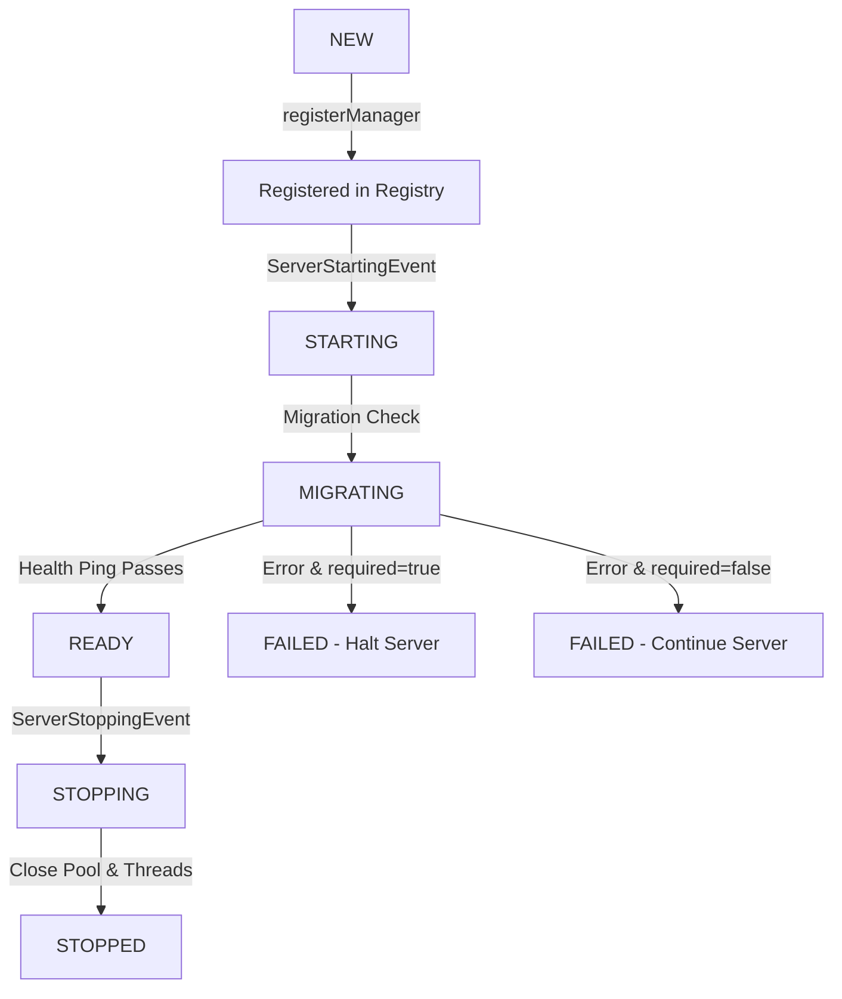

# BigBangEssentials - Módulo de Banco de Dados

Este documento descreve o funcionamento, a arquitetura e a especificação do novo módulo de infraestrutura de Banco de Dados do BigBangEssentials.

---

## 1. Objetivo do Módulo

O objetivo deste módulo é prover uma infraestrutura de persistência de dados robusta e unificada para o mod, com suporte a **SQLite** (padrão local) e **MySQL** (produção multiserver).

Nesta fase, a camada JDBC já está sendo usada de forma real para **preferências de jogador, nicknames, tags, lista de ignore e alguns toggles de interface/chat**. Economia, homes, warps, kits e boa parte da moderação continuam utilizando seus respectivos arquivos JSON locais. Ou seja: o banco não é mais apenas infraestrutura, mas ainda não é o armazenamento de todo o mod.

### Teste da economia

SQLite é coberto por `./gradlew :common:test`. MySQL não é iniciado implicitamente: o perfil de homologação deve fornecer `type=MYSQL` e `mysql.host`, `mysql.port`, `mysql.database`, `mysql.username` e `mysql.password` ao `DatabaseConfigLoader`. O repositório ainda não possui a task `mysqlIntegrationTest`; a validação MySQL/Testcontainers permanece pendente.

---

## 2. Localização dos Arquivos

*   **Configuração**: `world/serverconfig/bigbangessentials/database.json`
*   **Banco de Dados SQLite**: `bigbangessentials/database/bigbangessentials.db`
*   **Código Principal**: `com.pedrodalben.bigbangessentials.database.*`

---

## 3. Configuração (`database.json`)

Abaixo está o arquivo de configuração gerado automaticamente na inicialização com os valores padrão recomendados:

```json
{
  "enabled": true,
  "required": false,
  "type": "SQLITE",

  "sqlite": {
    "file": "bigbangessentials/database/bigbangessentials.db",
    "wal": true,
    "foreignKeys": true,
    "busyTimeoutMs": 5000
  },

  "mysql": {
    "host": "127.0.0.1",
    "port": 3306,
    "database": "bigbangessentials",
    "username": "bigbangessentials",
    "password": "${ENV:BBE_DATABASE_PASSWORD}",
    "sslMode": "PREFERRED",
    "serverTimezone": "UTC"
  },

  "pool": {
    "maximumPoolSize": 5,
    "minimumIdle": 1,
    "connectionTimeoutMs": 5000,
    "validationTimeoutMs": 3000,
    "idleTimeoutMs": 600000,
    "maxLifetimeMs": 1800000,
    "keepaliveTimeMs": 120000
  },

  "executor": {
    "threads": 2,
    "queueCapacity": 1000,
    "shutdownTimeoutSeconds": 10
  },

  "migrations": {
    "enabled": true,
    "validateChecksums": true,
    "failOnChecksumMismatch": true
  },

  "debug": {
    "logQueries": false,
    "logSlowQueries": true,
    "slowQueryThresholdMs": 500
  }
}
```

### Resolução de Variáveis de Ambiente
O carregador de configuração suporta interpolação de variáveis de ambiente no formato `${ENV:NOME_DA_VARIAVEL}` (por exemplo, no campo `password` do MySQL). A interpolação ocorre apenas em memória; os valores reais resolvidos **nunca são gravados de volta no arquivo de configuração** para garantir a segurança das credenciais. Caso a variável configurada não exista, a inicialização falha com erro descritivo.

### Restrições Específicas do SQLite
Quando o tipo de banco for `SQLITE`, os seguintes limites são aplicados internamente de forma automática, independentemente do que for definido no JSON:
*   `maximumPoolSize` = 1
*   `executor.threads` = 1

Isso previne problemas de concorrência causados por múltiplos acessos de gravação no arquivo SQLite.

---

## 4. Cuidados com a Thread Principal do Minecraft

> [!IMPORTANT]
> **Nenhuma operação comum de banco de dados deve rodar de maneira síncrona na thread principal do Minecraft.**
> O bloqueio do banco de dados causaria quedas drásticas de TPS (Ticks Per Second) ou congelamento do servidor.

Toda execução de queries normais deve ser submetida de forma assíncrona ao `DatabaseExecutor`. O executor fornece uma API baseada em `CompletableFuture` que utiliza um pool de threads dedicado do tipo daemon (`BigBangEssentials-Database-1`, etc.).

Operações síncronas são aceitáveis **apenas** durante:
1.  A inicialização inicial do mod (`ServerStartingEvent`).
2.  A execução manual de migrações via comando.
3.  O encerramento do mod (`ServerStoppingEvent`).
4.  Testes unitários e de integração.

---

## 5. Lifecycle do Banco de Dados



### Inicialização (`ServerStartingEvent`)
O `DatabaseManager` é inicializado logo após o carregamento das configurações do servidor e antes dos módulos de jogo. 
*   **required: false (padrão)**: Se a conexão com o banco falhar, o mod registrará o erro no log, marcará o estado como `FAILED` no `ManagerRegistry` e continuará a inicialização do servidor. Queries futuras falharão com um erro explícito e seguro.
*   **required: true**: Qualquer falha de banco (conexão, credenciais ou migrações) lançará uma exceção crítica que impedirá a inicialização do servidor.

### Shutdown (`ServerStoppingEvent`)
Durante o desligamento do servidor, o banco é desligado por último (após os demais módulos de jogo), permitindo que persistências de shutdown ainda ocorram com segurança. O encerramento do banco executa os seguintes passos:
1.  Muda o estado para `STOPPING`.
2.  Rejeita novas tarefas no executor.
3.  Aguarde tarefas pendentes finalizarem (timeout padrão de 10s).
4.  Cancela tarefas restantes com segurança.
5.  Fecha o pool de conexões do HikariCP.
6.  Transiciona para `STOPPED`.

---

## 6. Sistema de Migrações Versionadas

O mod conta com um sistema próprio de migrações JDBC sem a dependência de ORMs. 
*   Cada migração possui uma `version` (única), uma `description` e um `checksum` MD5/SHA.
*   As migrações são executadas em ordem crescente.
*   Os resultados de cada migração (tempo de execução, sucesso, checksum) são salvos na tabela `bbe_schema_migrations`.
*   Qualquer incompatibilidade de checksum ou falha em DDL interrompe a sequência de migração, marcando a inicialização como falha.

### Tabelas Internas Criadas (Versão 1)
A migração `V001CreateDatabaseInfrastructure` cria as tabelas internas:
1.  **`bbe_schema_migrations`**: Armazena o histórico e status das migrações aplicadas.
2.  **`bbe_metadata`**: Tabela chave-valor genérica para armazenar dados globais do servidor.

---

## 7. API Pública (`DatabaseAPI`)

Qualquer plugin ou módulo externo pode verificar o status e o tipo do banco de dados através da classe estática `DatabaseAPI`:

```java
public final class DatabaseAPI {
    // Retorna se o banco de dados está pronto
    public static boolean isAvailable();

    // Retorna o estado (READY, DEGRADED, FAILED, etc.)
    public static DatabaseState getState();

    // Retorna o tipo (SQLITE ou MYSQL)
    public static DatabaseType getType();

    // Executa um teste de latência e ping de forma assíncrona
    public static CompletableFuture<DatabaseHealth> healthCheck();
}
```

---

## 8. Comandos Administrativos

Os seguintes subcomandos estão disponíveis sob a árvore `/bigbangessentials database` (ou `/neoe database`):

*   **`/bigbangessentials database status`**: Exibe o status da conexão, latência de ping, versão atual do schema, contadores de queries (totais, falhas, lentas) e informações de conexões ativas/ociosas no pool Hikari.
*   **`/bigbangessentials database test`**: Executa um teste de conexão assíncrono (ping) sem travar a thread de tick do jogo, exibindo a latência medida.
*   **`/bigbangessentials database info`**: Exibe as configurações do banco de forma sanitizada (ocultando a senha).
*   **`/bigbangessentials database migrate`**: Executa de forma assíncrona qualquer migração pendente no banco de dados.

---

## 9. Backup do SQLite

Para bancos SQLite locais, o arquivo de banco de dados fica no diretório `bigbangessentials/database/bigbangessentials.db`.
*   O arquivo pode ser copiado livremente com o servidor desligado.
*   Com o servidor ligado em modo **WAL (Write-Ahead Logging)**, garanta que os arquivos `-wal` e `-shm` sejam copiados juntos com o arquivo `.db` principal para evitar corrupção de dados.
# Economy integration testing

SQLite is covered by the regular `./gradlew :common:test` suite. MySQL is not started implicitly: run the same economy tests against a disposable MySQL instance by supplying the database configuration used by `DatabaseConfigLoader` (`type=MYSQL`, `mysql.host`, `mysql.port`, `mysql.database`, `mysql.username`, `mysql.password`) before adding the CI/Testcontainers profile. The repository currently has no `mysqlIntegrationTest` task, so MySQL validation is a remaining homologation item.
